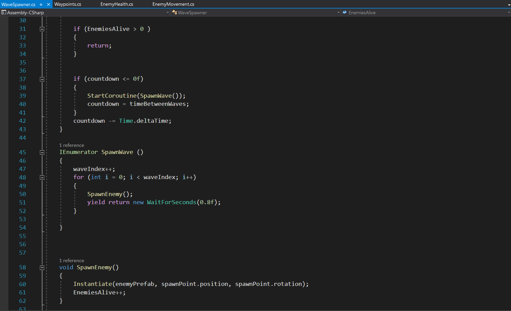
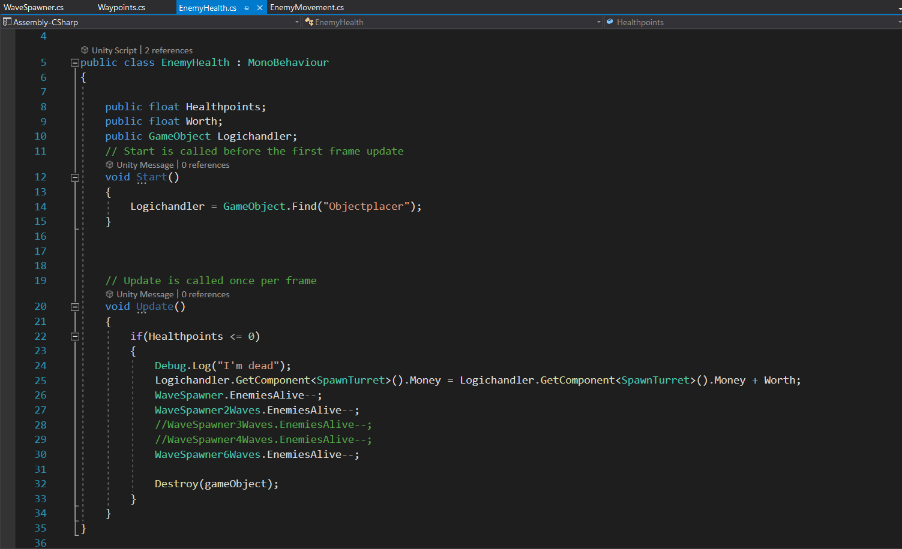
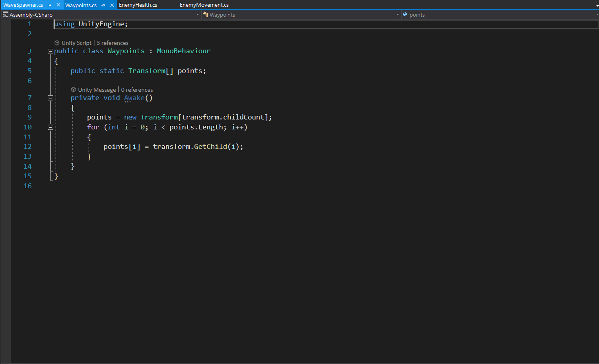
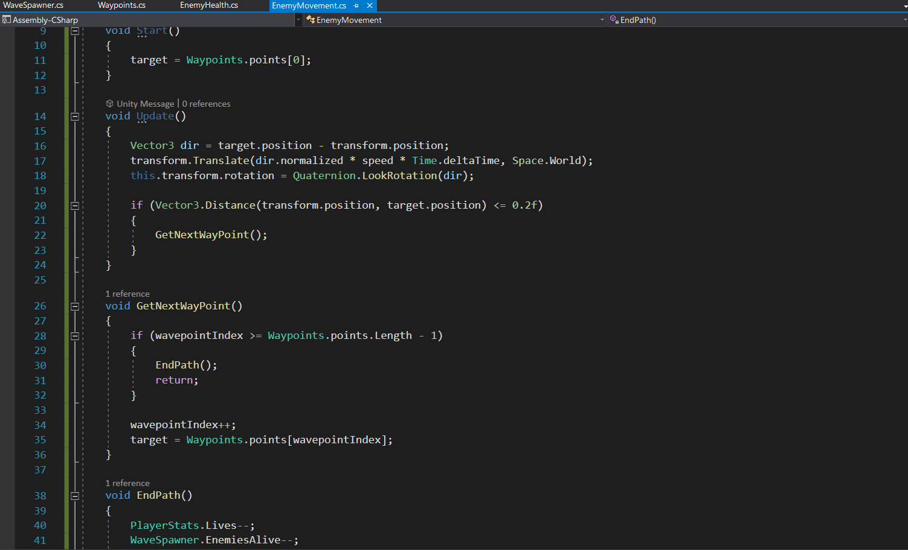

<!doctype html>
<html>
  <head>
    <title>Tower Defense</title>
  </head>

  <body>
    <h1>GAME DESIGN DOCUMENT.</h1>
   <h2>
<strong>Tower Defense / Turna Vörnin</strong>
</h2>
    <h3>3D Strategy eða Herstjórnar leikur.</h3>
    
    <h3>1.1  Liðin.</h3>
    

    Það eru 2 lið eins og er, við stöndum með turnunum, við eigum að búa til turna til að hindra það að óvinurinn komist ekki til leiðarenda.
     
    Óvinirnir eru farartæki sem er klætt grænum her búnaði, það mun vera trukkar, smábílar og jafnvel flugvélar.
    

    <h2>Óvinirnir.</h2>
    <h3>Það eru 3 óvinir.</h3>
    <h4>Truck</h4>
    
    
Þetta mun vera fyrsti óvinurinn og mun sjást í öllum borðum.
     
    Þessi bíll er algengasti óvinurinn og er voða lítið sérstakt við hann.
     
    Hann hefur 30 líf, 10 í hraða, og virði 75 dollara.

     

    <h4>Jeep</h4>
    
    
Þetta mun vera annar óvinurinn og mun sjást í borði 2 og 3.
     
    Þessi bíll er smár, en mjög hraður.
     
    Hann hefur 15 líf, 25 í hraða, og virði 40 dollara.

    
    <h4>Airplane</h4>
    
    
Þetta mun vera þriðji óvinurinn og mun sjást í borði 3.
     
    Þessi flugvél er kröftug, fer hægt og með mikið líf, og þarf ekki að fylgja sömu reglum og bílarnir.
     
    Flugvélin getur farið yfir varnirnar og veggina þar sem hún getur flogið yfir allt til leiðarenda.
     
    Flugvélin hefur 140 líf, 4.5 í hraða, og virði 100 dollara.

    <h2>Turnarnir</h2>
    <h3>Það eru 2 turnar.</h3>
    <h4>Normal Tower</h4>
    
    
Þetta mun vera fyrsti turninn.
     
    Þessi turn skýtur hægt, hefur langt drif og gerir mikinn skaða.
     
    Turninn hefur skothraðann 1, drif 30 og gerir 5 skaða.
     
     
    <h4>Sentry Tower</h4>
    
    
Þetta mun vera annar turninn.
     
    Þessi turn skýtur hratt, hefur stutt drif og gerir lítinn skaða.
     
    Turninn hefur skothraðann 10, drif 15 og gerir 0.25 skaða.
     
     
     
    <h2>Borð Yfirlit</h2>
        <h3>Það eru 3 borð.</h3>
    <h4>Level 1</h4>
    
    
Þetta mun vera borð nr 1, eða fyrsta level.
     
    Fyrsta borðið hefur bara venjulega trukkana og fara þeir sikksakk meðfram veggjunum.
     
     
    <h4>Level 2</h4>
    
    
Þetta mun vera borð nr 2, eða annað level.
     
    Annað borðið hefur 2 óvini sem eru venjulegu trukkarnir og litlu bílarnir.
     
    Markmiðið þeirra er að fara í snúð í kringum borðið og inn í miðjuna.
     
    Þegar þeir komast í miðjuna missir leikmaðurinn líf.
     
     
    <h4>Level 3</h4>
    
    
Þetta mun vera borð nr 3, eða þriðja level.
     
    þriðja borðið hefur 3 óvini sem eru venjulegu trukkarnir, litlu bílarnir og flugvélar.
     
    Í þessu leveli verðuru að gera þér grein fyrir að flugvélarnar fara yfir veggina og turnana.
     
    Þannig þú verður að reikna með staðsetningunni fyrir turnana vel svo þeir drífa í allt.
     
     
     
    <h2>Nokkrar Skriptur</h2>
    

    <h4>WaveSpawner</h4>
    
    
WaveSpawner skriptan les út hvenær má og má ekki senda óvini út á borðið.
     
    Þegar borðið byrjar mun skriptan gefa nokkrar sekúndur áður en hún leggur fram óvinina. 
    Hún mun telja fram óvinina og ef það eru óvinir á borðinu stoppar skriptan 
    Þegar óvinur kemur á borðið mun bætast í 'EnemiesAlive'  
    þegar 'EnemiesAlive' fer í 0 þá mun skriptan gefa nokkrar sekúndur áður en næsta alda byrjar 
     
    

    <h4>EnemyHealth</h4>
    
    
EnemyHealth skriptan er bæði til að telja niður lífið á óvinum, 
    og fyrir Wavespawner skriptuna til að lesa út hvenær það eru óvinir eftir á borðinu.
     
     
    

    <h4>Waypoints</h4>
    
    
Waypoints skriptan er nýtt til að láta óvini elta ákveðna punkta í gegnum borðið 
    Þessi skripta er aðeins hægt að nýta ef þú setur nokkra waypoints inn í 'Empty Object' 
     
     
    

    <h4>Enemymovement</h4>
    
    
Enemymovement skriptan er sett á óvinina til að láta þá elta waypoints 
    Þegar óvinirnir eru búnir að fara í gegnum alla punktana eða 'Childs' 
    Þá eyðist óvinurinn upp og leikmaðurinn missir líf.
     
     
    <h2>Aukapunktar.</h2>
    
Ég hef alltaf verið hrifinn af smáleikjunum sem er hægt að demba nokkrum mínútum í turna vörn,  
        það er hægt að finna endalaust af slíkum leikjum sem eru svipaðir,  
        sumir hafa svona sitt eigið snúning á leiknum. 
         
        Stundum getur það verið rosalega flott, vel gert og vel úthugsað, og stundum er það algjört klúður og vesen. 
         Ég vildi læra mig áfram og gera svona frekar einfaldann Turna Vörn leik, 
         klassískir turnar, klassískir óvinir.  
         
         Því lengra sem ég fer inn, finn ég alltaf fleiri leiðir sem hægt er að fikta mig áfram í einu og öðru, 
          bæta við öðruvísi turnum eða jafnvel öðruvísi óvinum.

           
           
           
           
    

</body>
</html>
  
